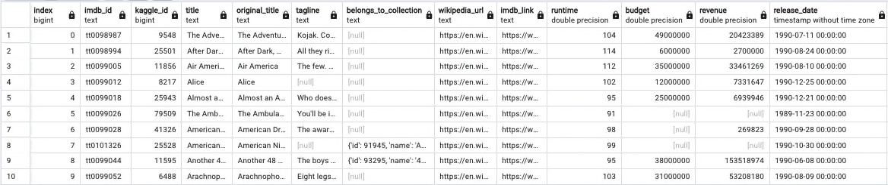

# Extract Transform and Load Movie Data into a PostgreSQL DB

## Overview
Amazing Corporation hosts several hack-a-thons throughout the year. For the lastest hack-a-thon, we need a DB of movie data from various sources.  This data will be in CSV files and has a lot of useful information but much of it is not very useful, redundant or not formatted consistently.

This project will take in files from Wikipedia and Kaggle and MovieLens containing data describing thousands of movies.  It performs the ETL process to transform the data in a useable format and store it in 2 tables, movies and ratings, stored in a PostgreSQL database to be used by participants in the hack-a-thon for their various projects.

## Process
The following steps were taken for this project:
- An ETL Function was developed and tested to read 3 datafiles in various formats to create CSV files to load into the DB.
- Extract and Transform Wikipedia movie data.
- Extract and Transform Kaggle movie data.
- Extract and Transform Kaggle ratings data.
- Create a movie datbase with tables loaded from Wikipedia and Kaggle.

## Supporting Files/Folders
The top level files and folders are as follows:
### Resources
This folder contains the CSV files that were used to populate the movie database.
- movies_metadata.csv.zip: original movie data downloaded from Kaggle.
- movies_query.png: shows the correct number of rows were added to the movies table.
- ratings_query.png: shows the correct number of rows were added to the ratings table.
- wikipedia-movies.json: original file with movie data downloaded from wikipedia.

### Images
Images used in this readme to describe the tables to be used for the hack-a-thon.

## Movies Table MetaData

The following images give a snapshot of some of the data in the movies table that participants can use for their projects:

## Ratings Table MetaData

The following image shows a snapshot of the first 10 movies in the Ratings data:

This image shows a snapshot for the movie with id 110. Note there is a timestamp and several thousand rows for one movie. Having this table separate from the movies table will allow the users to access these ratings on a finer level without bogging down the main movies database which contains more detail about each movie.

